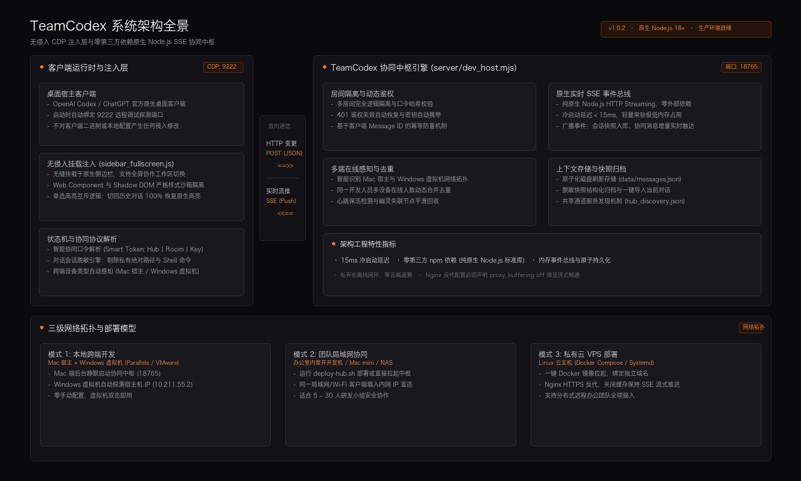
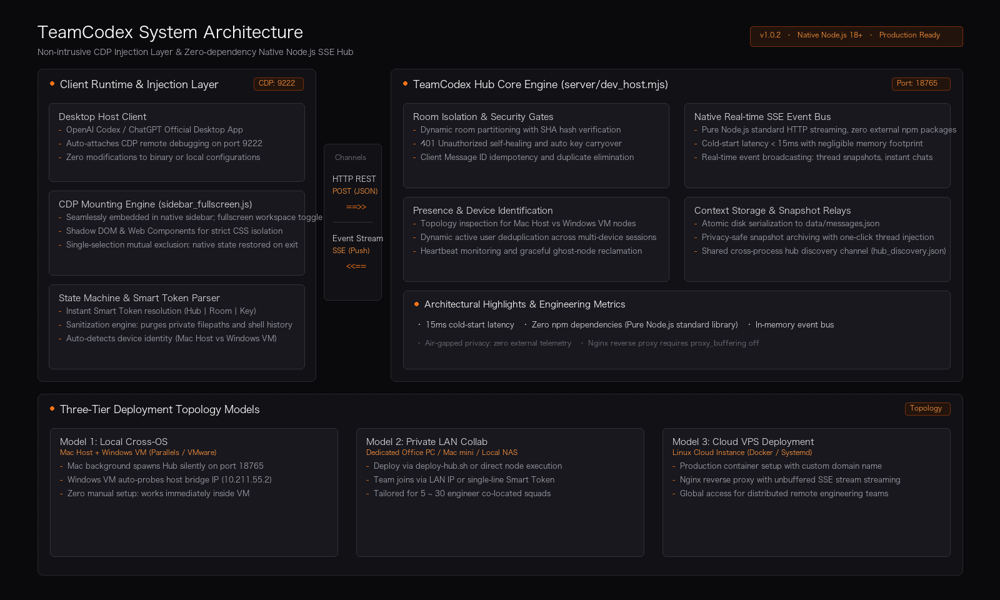

# TeamCodex

面向 Codex 与 ChatGPT 桌面端的轻量级无侵入实时协同工作区与上下文同步中枢。  
Seamless Real-time Collaboration Workspace & Context Hub for Codex & ChatGPT Desktop.

[](https://github.com/we1jia/TeamCodex/releases)
[](https://github.com/we1jia/TeamCodex/actions)
[](tests/)
[](https://github.com/we1jia/TeamCodex/releases)
[](server/dev_host.mjs)
[](LICENSE)

[English](#english) | [中文](#中文)

---

<a id="中文"></a>

## 中文

### 1. 概述

TeamCodex 解决 AI 编程桌面端（OpenAI Codex / ChatGPT）长期存在的**单机隔离痛点**。通过 CDP (Chrome DevTools Protocol) 协议在原生客户端侧边栏内嵌全功能协作面板，配合纯原生 Node.js SSE 事件中枢（零第三方 npm 依赖），实现毫秒级成员在线感知、会话快照脱敏归档与跨端上下文秒级导入。

<p align="center">
  
</p>

---

### 2. 客户端下载

前往 **[GitHub Releases 最新发布页](https://github.com/we1jia/TeamCodex/releases)** 下载官方原生安装包：

| 平台 | 安装包 | 安装方式 |
|---|---|---|
| **macOS** | [`TeamCodex-macOS.dmg`](https://github.com/we1jia/TeamCodex/releases/latest) | 打开磁盘镜像，将 `TeamCodex.app` 拖入 `Applications` 目录即可 |
| **Windows** | [`TeamCodex-Setup.exe`](https://github.com/we1jia/TeamCodex/releases/latest) | 双击安装向导，自动适配 ARM64/AMD64 并生成桌面无黑框快捷方式 |
| **免安装便携版** | `TeamCodex-macOS.zip` / `TeamCodex-Windows-arm64-amd64.zip` | 解压即用，适合移动介质或严格权限环境 |

---

### 3. 部署方案与网络拓扑

中枢服务（Hub）支持从本地单机到私有云的三种运行模式：

| 模式 | 运行位置 | 客户端接入方式 | 适用场景 |
|---|---|---|---|
| **单机跨端（默认）** | Mac 宿主机后台静默自启 | Windows 虚拟机自动探测宿主机 IP 直连 | Mac + Win 虚拟机本地开发（零配置） |
| **局域网协同** | 办公室内常开 PC / Mac / NAS | 填入该主机局域网 IP 或粘贴 Smart Token | 5 ~ 30 人同内网/同 Wi-Fi 研发小组 |
| **云端公网部署** | Linux 云服务器 (VPS) | 绑定域名并通过 Nginx HTTPS 反代接入 | 跨地域、远程办公的分布式团队 |

---

### 4. 中枢极速部署（局域网 / 云端）

#### 选项 A：一行命令自动化部署（推荐服务器使用）
```bash
curl -fsSL https://raw.githubusercontent.com/we1jia/TeamCodex/main/scripts/deploy-hub.sh | bash
```
脚本自动探测系统环境：优先通过 Docker Compose 启动容器；无 Docker 时自动注册 Systemd 或 PM2 守护进程，并自动执行健康自检。

#### 选项 B：一键发给终端 AI Agent 的部署提示词
使用 Claude Code、Codex、Cursor、OpenClaw 等终端 AI 运维服务器时，直接复制以下提示词发送：

```text
请帮我在当前服务器部署 TeamCodex Hub 中枢服务：
1. 检查服务器环境（需 Docker/Docker Compose 或 Node.js >= 18）；
2. 克隆 https://github.com/we1jia/TeamCodex.git 至 /opt/TeamCodex（若存在则 git pull）；
3. 优先执行 docker compose up -d，无 Docker 则创建 systemd 守护服务并设置开机自启；
4. 开放 18765 端口并监听 0.0.0.0；
5. 执行 curl http://127.0.0.1:18765/api/health 验证健康度；
6. 若有 Nginx，请配置反代，注意必须包含 proxy_buffering off 以保证 SSE 流式推送正常；
7. 输出本机的访问地址与测试 Smart Token。
```

完整参数表、Docker 编排配置与 Nginx SSL 模板参见：**[中枢部署与网络接入全景指南 (docs/HUB_DEPLOYMENT.md)](docs/HUB_DEPLOYMENT.md)**。

---

### 5. 核心特性

- **无侵入侧栏内嵌**：基于 CDP 动态挂载，无需反编译或修改客户端本地文件。
- **高亮生命周期互斥**：全屏协作与原生会话保持单选高亮，切回历史对话 100% 恢复原生高亮。
- **跨平台多端识别**：自动探测网络与操作系统，智能区分 `Mac` 与 `Win` 设备身份，在线人数自动去重。
- **脱敏快照与上下文接力**：一键打包会话并剔除本地路径与 Shell 命令，协作者可一键导入当前活动对话。
- **智能协同口令 (Smart Token)**：支持形如 `Hub: <URL> | Room: <Name> | Key: <Password>` 的单行口令秒级加入。

---

### 6. 仓库结构

```text
TeamCodex/
├── inject/                     # CDP 客户端侧注入层、Web Component 与全屏协作 UI
├── server/                     # 零依赖原生 Node.js SSE 实时协作中枢 (dev_host.mjs)
├── macos/                      # macOS 启动器 (launch.sh)、自包含 DMG 打包工程
├── windows/                    # Windows 启动套件、NSIS 安装包脚本 (installer.nsi)
├── scripts/                    # 运维与自动化部署脚本 (deploy-hub.sh)
├── docs/                       # 架构设计与网络接入全景指南 (HUB_DEPLOYMENT.md)
├── tests/                      # 37 项自动化单元测试与端到端状态机测试套件
├── Dockerfile                  # 极简 Alpine Node 生产镜像定义
├── docker-compose.yml          # 一键容器化服务编排
└── README.md
```

---

### 7. 自动化测试

```bash
node --test tests/test_boost_fixes.mjs
node --test tests/test_rooms_and_auth.mjs
```

---

### 8. 常见问题 (FAQ)

- **Q: 个人在本地单机使用，需要额外搭建服务器吗？**  
  **不需要**。macOS 启动时会自动常驻轻量中枢，Windows 虚拟机客户端通过虚拟网络自动发现并连入，完全免配置。
- **Q: 数据安全与隐私边界如何保证？**  
  **纯局域网与私有部署**。数据存储于自建环境的 `data/messages.json`，无任何外部云端遥测。
- **Q: 通过 Nginx 反代后消息无法实时推送？**  
  SSE 依赖流式长连接，Nginx 对应 `location` 必须配置 `proxy_buffering off;`。

---

<a id="english"></a>

## English

### 1. Overview

TeamCodex eliminates the **isolation constraint** inherent in desktop AI clients (OpenAI Codex / ChatGPT). By utilizing the Chrome DevTools Protocol (CDP), it embeds an integrated collaboration workspace directly into the native sidebar. Powered by a zero-external-dependency Node.js SSE event bus, it provides peer presence heartbeats, sanitized dialogue snapshots, and instant cross-session context relay.

<p align="center">
  
</p>

---

### 2. Client Downloads

Grab pre-built installers directly from **[GitHub Releases](https://github.com/we1jia/TeamCodex/releases)**:

| Platform | Installer | Setup Method |
|---|---|---|
| **macOS** | [`TeamCodex-macOS.dmg`](https://github.com/we1jia/TeamCodex/releases/latest) | Mount the disk image and drag `TeamCodex.app` into `/Applications` |
| **Windows** | [`TeamCodex-Setup.exe`](https://github.com/we1jia/TeamCodex/releases/latest) | Run setup wizard for automated ARM64/AMD64 setup and desktop shortcuts |
| **Portable Archives** | `TeamCodex-macOS.zip` / `TeamCodex-Windows-arm64-amd64.zip` | Standalone portable green packages |

---

### 3. Deployment Topology Models

The Hub service supports three standard operational models:

| Model | Host Location | Client Connection | Target Scenario |
|---|---|---|---|
| **Single-Host (Default)** | macOS background auto-spawn | Windows VM auto-detects host bridge IP | Solo developers with Mac + VM setups (Zero config) |
| **Private LAN** | Always-on PC / Mac / NAS in LAN | Enter host LAN IP or paste Smart Token | 5 ~ 30 developer teams on shared office Wi-Fi |
| **Cloud VPS** | Linux Cloud Server | Domain name via Nginx HTTPS proxy | Globally distributed remote teams |

---

### 4. Hub Deployment & Automation (LAN / Cloud)

#### Option A: One-Line Automation Script
```bash
curl -fsSL https://raw.githubusercontent.com/we1jia/TeamCodex/main/scripts/deploy-hub.sh | bash
```
Detects environment automatically: prefers Docker Compose; falls back to Node.js with Systemd / PM2 process supervision and automated health verification.

#### Option B: AI Agent System Prompt
Copy and paste this structured prompt directly to terminal AI assistants (Claude Code, Codex, Cursor, OpenClaw):

```text
Deploy TeamCodex Hub on this server following production standards:
1. Verify system dependencies (Docker/Docker Compose or Node.js >= 18);
2. Clone https://github.com/we1jia/TeamCodex.git to /opt/TeamCodex (or git pull latest main);
3. Prefer docker compose up -d; if Docker is absent, configure systemd service with auto-start;
4. Open port 18765 listening on 0.0.0.0;
5. Validate via: curl http://127.0.0.1:18765/api/health;
6. If Nginx is detected, configure reverse proxy with proxy_buffering off explicitly set for SSE streaming;
7. Output endpoint URL and a ready-to-use Smart Token.
```

Full documentation and Nginx TLS templates available at: **[Hub Deployment & Networking Guide (docs/HUB_DEPLOYMENT.md)](docs/HUB_DEPLOYMENT.md)**.

---

### 5. Core Capabilities

- **Non-Intrusive Mounting**: Injects via CDP without modifying binary executables or user configurations.
- **State Machine Mutual Exclusion**: Enforces single-selection highlighting during active collaboration, restoring native thread selections upon exit.
- **Cross-Platform Presence**: Cleanly isolates `Mac` vs `Win` node identities with deduplicated active presence counters.
- **Sanitized Snapshot Relay**: Serializes conversation threads into privacy-safe snapshots, enabling peers to import context with a single click.
- **Smart Token Protocol**: Resolves connection strings formatted as `Hub: <URL> | Room: <Name> | Key: <Password>` instantly.

---

### 6. Repository Layout

```text
TeamCodex/
├── inject/                     # Client CDP injection, Web Components & UI logic
├── server/                     # Zero-dependency Node.js SSE Hub (dev_host.mjs)
├── macos/                      # macOS launcher (launch.sh) & self-contained DMG builder
├── windows/                    # Windows launcher suite & NSIS script (installer.nsi)
├── scripts/                    # Deployment & maintenance tools (deploy-hub.sh)
├── docs/                       # Architectural & deployment manuals (HUB_DEPLOYMENT.md)
├── tests/                      # 37 automated unit and end-to-end test cases
├── Dockerfile                  # Lightweight Alpine production container definition
├── docker-compose.yml          # Container orchestration configuration
└── README.md
```

---

### 7. Automated Testing

```bash
node --test tests/test_boost_fixes.mjs
node --test tests/test_rooms_and_auth.mjs
```

---

### 8. FAQ

- **Q: Does a solo developer on one machine need to host a cloud server?**  
  **No**. macOS auto-starts the hub in the background, and Windows VM guests auto-detect the bridge IP out of the box.
- **Q: Is conversation data transmitted to external third parties?**  
  **No**. TeamCodex operates purely on self-hosted instances. Data is confined to your own `data/messages.json`.
- **Q: Real-time updates do not reach clients when behind Nginx?**  
  SSE streaming requires unbuffered connections. Ensure **`proxy_buffering off;`** is present in the Nginx `location` block.
